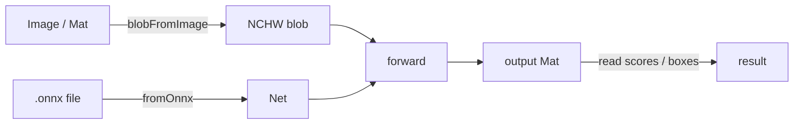

# Deep learning (DNN)

Sometimes the vision task you have — "is this a cat or a dog?", "where are the people in this frame?",
"what depth is each pixel?" — has no clean geometric answer, only a *learned* one. That is what a neural
network is for, and OpenCV can run one for you without dragging in PyTorch, TensorFlow, or a GPU runtime:
its `dnn` module loads a trained model and does the forward pass on plain CPU.

scalacv wraps `org.opencv.dnn` as three small, honest functions — **load a model, turn an image into the
blob the model expects, run one forward pass** — and nothing else. Everything they hand back is a
[`Managed`](/mat-lifecycle), so the native memory frees itself when its scope ends.

:::note What this is not
This is an *inference* engine, not a *training* one. You bring a model that was already trained
elsewhere and exported to ONNX; scalacv runs it. There is no autograd, no optimiser, no fine-tuning here.
:::

```scala mdoc:invisible
import scalacv.*
import org.opencv.core.{CvType, Mat}
OpenCv.load()
lazy val net: org.opencv.dnn.Net = ??? // from Dnn.fromOnnx(path)
```

## The whole pipeline at a glance

Every DNN task in scalacv is the same three steps in the same order. The whole surface is one object,
`Dnn`, with three methods:

| Step | Method | Takes | Gives back | Ownership |
| --- | --- | --- | --- | --- |
| 1. Load | `Dnn.fromOnnx(path)` | a `.onnx` file path | `Either[CvError, Managed[Net]]` | caller-owned `Net` |
| 2. Pre-process | `Dnn.blobFromImage(mat, …)` | a `Mat` + normalisation params | `Managed[Mat]` (the blob) | caller-owned blob |
| 3. Infer | `Dnn.forward(net, blob)` | the `Net` and the blob | `Managed[Mat]` (the output) | caller-owned output |

The **only** hard parts are step 2 (getting the normalisation exactly like the model's training) and
reading step 3's output (its shape depends entirely on what the model does). The rest is plumbing that a
`Managed` scope handles for you.



## A minimal first run

Assuming you have an image classifier exported to ONNX, the whole thing fits in one nested chain. It needs
a real model file on disk, so this is shown as compile-only:

```scala mdoc:compile-only
import org.opencv.core.Core

val topClass: Either[CvError, Int] =
  Images.read("cat.jpg").flatMap { managedMat =>
    managedMat.use { mat =>
      Dnn.fromOnnx("models/mobilenet.onnx").map { managedNet =>
        managedNet.use { net =>
          Dnn
            .blobFromImage(mat, scaleFactor = 1.0 / 255, size = Some(Size(224, 224)), swapRB = true)
            .use { blob =>
              Dnn.forward(net, blob).use { output =>
                // A classifier's output is (1, N) scores; the argmax is the predicted class index.
                Core.minMaxLoc(output).maxLoc.x.toInt
              }
            }
        }
      }
    }
  }
```

Read that from the outside in: each `Managed` is opened with `.use`, and each closes — freeing its native
memory — at the end of its block, innermost first. Nothing leaks even if a step throws. The rest of this
page unpacks each stage.

## Only ONNX, and why

OpenCV can also read Caffe, Darknet, TensorFlow, TFLite and Torch graphs. scalacv exposes **only** ONNX.
Each of those other importers carries its own set of unsupported-layer failure modes, and offering seven
entry points would imply a breadth of support this library cannot honestly stand behind. ONNX is the
format the other frameworks *export to*, so a single importer covers the realistic cases — and you convert
a model to ONNX once, rather than debugging a different importer per framework.

:::tip Getting a model into ONNX
Most training frameworks export in one line — `torch.onnx.export(...)` in PyTorch,
`tf2onnx` for TensorFlow, `skl2onnx` for scikit-learn. Model zoos such as the
[ONNX Model Zoo](https://github.com/onnx/models) publish ready-to-run `.onnx` files for common
classifiers and detectors. Whatever the source, you want a model with a **fixed** input shape unless you
intend to pass `size = None` (see [blobFromImage](#making-a-blob-blobfromimage)).
:::

## Loading a model

`Dnn.fromOnnx` reads a `.onnx` file and hands back a **caller-owned** `Net` wrapped in a `Managed`:

```scala mdoc:compile-only
val loaded: Either[CvError, Managed[org.opencv.dnn.Net]] =
  Dnn.fromOnnx("models/resnet50.onnx")

loaded.foreach { managed =>
  managed.use { net =>
    // ... run inference inside this scope; the Net frees at the end ...
  }
}
```

Every way loading can fail is a `Left[CvError]`, and the reasons are deliberately not distinguished:
OpenCV reports a missing file, a file of arbitrary bytes and a structurally invalid graph as three
*different* native exceptions from three different lines of `onnx_importer.cpp`, none of which is a stable
interface worth pattern-matching. What a caller needs to know is that the model did not load and the
process is still alive. The failure arrives as [`CvError.LoadFailed`](/error-model), whose `resource`
field names the file you asked for:

```scala mdoc:compile-only
Dnn.fromOnnx("models/does-not-exist.onnx") match
  case Left(CvError.LoadFailed(resource, details)) =>
    println(s"could not load $resource: $details")
  case Left(other) => println(s"unexpected: $other")
  case Right(managed) => managed.release()
```

Two checks bracket the native read:

- **The path is checked first**, before OpenCV sees it. That is the only way a missing or unreadable file
  gets an error message that names the file, rather than one quoting a C++ source location.
- **An empty-net guard afterwards.** 4.13.0's importer throws rather than returning an empty `Net`, but
  sibling readers in the same header do not all behave that way, and an empty `Net` that slips through
  fails much later — inside `forward` — with nothing pointing back at the load.

`Net` is one of the OpenCV types with no public `release()`, so `fromOnnx` frees it through the safe
`delete(long)` handle bridge. If you obtain a `Net` some other way, `import Dnn.given` puts the same
`Releasable[Net]` in scope so you can wrap it in a `Managed` on the same terms:

```scala mdoc:compile-only
import Dnn.given

// A Net from an importer scalacv does not expose (here: quantised, or Darknet, or Caffe).
val raw: org.opencv.dnn.Net = org.opencv.dnn.Dnn.readNetFromONNX("models/quantised.onnx")
Managed(raw).use { net =>
  // now freed on the same terms as a fromOnnx Net
}
```

:::warning
Loading is not cheap and it is not something to do per frame. Parse the model **once** at startup, keep
the `Managed[Net]` alive for the life of the pipeline, and reuse it. See
[the threading note below](#one-net-per-thread) for how that interacts with concurrency.
:::

## Making a blob: `blobFromImage`

A network does not take an image; it takes a **blob** — a 4-dimensional `CV_32F` Mat in NCHW layout with
shape `(1, C, H, W)`: batch, channels, height, width. `Dnn.blobFromImage` builds one and returns it as a
caller-owned `Managed[Mat]`.

This one runs, against a synthetic image, so you can see the shape it produces:

```scala mdoc
Managed.use(Mat(64, 64, CvType.CV_8UC3, org.opencv.core.Scalar(100, 100, 100))) { image =>
  Dnn
    .blobFromImage(
      image,
      scaleFactor = 1.0 / 255,
      size = Some(Size(300, 200)),   // (width, height)
      mean = Scalar(123, 117, 104),  // per channel, in BLOB order
      swapRB = true,
      crop = false
    )
    .use { blob =>
      // dims == 4, and the four sizes are (1, C, H, W)
      (blob.dims(), (0 until blob.dims()).map(blob.size).toList)
    }
}
```

The image is a `Mat` you build and release with `Managed.use`; the blob is a `Managed[Mat]` you take with
`.use`. Both are caller-owned — `blobFromImage` takes ownership of nothing.

### The parameters

| Parameter | Type | Default | What it does |
| --- | --- | --- | --- |
| `mat` | `Mat` | — | the source image; must be non-empty |
| `scaleFactor` | `Double` | `1.0` | multiplier applied **after** the mean subtraction |
| `size` | `Option[Size]` | `None` | spatial size `(width, height)` to resize to; `None` keeps the source's |
| `mean` | `Scalar` | `Scalar(0,0,0)` | subtracted per channel, in the **blob's** channel order |
| `swapRB` | `Boolean` | `false` | swap the first and third channels (BGR→RGB) |
| `crop` | `Boolean` | `false` | `true` = resize-short-side-and-centre-crop; `false` = resize both axes |

### The three gotchas

- **`Size` is `(width, height)`, but the blob's trailing dims are `(height, width)`.** `Size(300, 200)`
  yields shape `(1, 3, 200, 300)` — note the transposition above. Getting this backwards is the usual
  cause of a network that runs and returns nonsense rather than an error.
- **`mean` is subtracted in the *blob's* channel order, after the swap.** With `swapRB = true` on an
  ordinary BGR image, the channels are RGB by the time the mean is applied, so `mean` is `(R, G, B)`.
  That is what published per-model mean triples assume. This is the one parameter here whose two readings
  differ by exactly the amount that makes a model quietly *worse* rather than visibly broken.
- **The arithmetic is `(pixel - mean) * scaleFactor`, in that order — `mean` is not scaled.** A model
  trained on `[0, 1]` inputs therefore wants `scaleFactor = 1.0 / 255` and a `mean` expressed in
  `[0, 255]`.

More on the last two:

- **`swapRB`** swaps the first and third channels. Almost every published model was trained on RGB while
  OpenCV decodes to BGR (see [Image I/O](/image-io)), so in practice this is usually `true`. It defaults
  to `false` only because that is OpenCV's own default.
- **`size`** is the spatial size to resize to; `None` keeps the source's own size, which is correct only
  for a network with a dynamic input shape. **`crop`** chooses between resize-and-centre-crop (`true`) and
  resize-both-axes-accepting-the-aspect-change (`false`).

An empty image, or a `size` that is given but not strictly positive, is rejected up front with an
`IllegalArgumentException` — OpenCV reads a zero extent as "do not resize", which would silently produce a
blob of the wrong shape:

```scala mdoc:crash
Managed.use(Mat()) { empty =>
  Dnn.blobFromImage(empty) // empty image -> IllegalArgumentException
}
```

### Recipes for common normalisations

The `scaleFactor` / `mean` combination is not something you invent — it must match how the model was
trained, and the training recipe ships with the model card. A few families you will meet often:

| Model family | `scaleFactor` | `mean` (blob order, RGB) | `swapRB` | `size` |
| --- | --- | --- | --- | --- |
| Caffe classics (ResNet, VGG, GoogLeNet) | `1.0` | `Scalar(104, 117, 123)` on **BGR** (`swapRB = false`) | `false` | `224×224` |
| TorchVision / ImageNet `[0,1]` normalise | `1.0 / 255` | `Scalar(123.675, 116.28, 103.53)` | `true` | `224×224` |
| MobileNet-SSD (Caffe) | `1.0 / 127.5` | `Scalar(127.5, 127.5, 127.5)` | `false` | `300×300` |
| YOLO (Darknet/ONNX export) | `1.0 / 255` | `Scalar(0, 0, 0)` | `true` | `416×416` or `640×640` |

:::tip
When a model runs but its predictions are consistently wrong, the mismatch is almost always here: the
wrong `mean`, a forgotten `swapRB`, or `scaleFactor` off by 255. Copy the recipe from the model's
documentation verbatim, then check nothing got transposed.
:::

## Running it: `forward`

`Dnn.forward` sets the blob as the network's input and runs the pass — in **one** call, on purpose. The
two underlying steps are not independently useful: a `Net` whose input is set but not forwarded is a
half-applied mutation, and a `forward` with no preceding `setInput` reads whatever the last caller left
behind. Fusing them makes the stateful pair atomic from the caller's point of view.

```scala mdoc:compile-only
Dnn.forward(net, blob = ???, outputName = None).use { output =>
  // output is a caller-owned Managed[Mat]; its shape is the network's, not the input's
  output.size(1)
}
```

- **`blob` is borrowed, not consumed** — but it must stay alive until `forward` returns. Releasing it
  mid-pass is a crash, not an exception, so keep it in a `Managed` that outlives the call.
- **`outputName`** selects which output blob to retrieve. `None` runs to the last layer, which is what a
  single-output classifier or regressor wants. For a multi-output network, pass a name; the valid names
  are `net.getUnconnectedOutLayersNames`. Note these are *blob* names — for an ONNX import, the graph's
  declared outputs, not the `onnx_node!…` layer names.

```scala mdoc:compile-only
// Discover the valid output names for a multi-output graph:
import scala.jdk.CollectionConverters.*
val names: Seq[String] = net.getUnconnectedOutLayersNames.asScala.toSeq
Dnn.forward(net, blob = ???, outputName = names.headOption).use { output =>
  output.dims()
}
```

### One `Net` per thread

A `Net` is stateful; `setInput` mutates it and `forward` reads that mutation back. `forward` fusing the two
narrows the window but is not a lock — a single `Net` still cannot be driven from two threads concurrently.
Use **one `Net` per thread**, or serialise access yourself. For a pool-of-workers pattern where each
worker owns its own `Net`, see [Concurrency](/concurrency).

## Reading the output

`forward` gives you a `Mat`, and its shape is entirely up to the model. Two common shapes:

### Classifiers: `(1, N)` scores

An image classifier outputs one score per class. The predicted class is the argmax, which
`Core.minMaxLoc` finds for you — it works directly on the `(1, N)` output:

```scala mdoc:compile-only
import org.opencv.core.Core

Dnn.forward(net, blob = ???).use { output =>
  val mm = Core.minMaxLoc(output)
  val classIndex = mm.maxLoc.x.toInt // column of the highest score
  val confidence = mm.maxVal          // the score itself (raw logit, unless the graph ends in softmax)
  (classIndex, confidence)
}
```

:::note Logits vs. probabilities
`maxVal` is whatever the last layer emits. Many exported graphs stop *before* the softmax, so the numbers
are unbounded logits, not `[0,1]` probabilities. The argmax is identical either way; only apply a softmax
yourself if you need a calibrated confidence.
:::

### Detectors: rows of boxes, then NMS

A detector emits many candidate boxes, most of them overlapping duplicates of the same object. Suppressing
the duplicates is **non-maximum suppression**, and OpenCV ships it as `org.opencv.dnn.Dnn.NMSBoxes` — you
feed it the boxes and their scores and it returns the indices to keep. Decoding a specific detector's raw
grid into boxes is model-specific (YOLO, SSD and DETR all differ), so this is shown as an unchecked sketch:

```scala
import org.opencv.core.{MatOfRect2d, MatOfFloat, MatOfInt, Rect2d}

// after you have decoded the raw output into parallel boxes + scores:
val boxes: MatOfRect2d = ???   // one Rect2d per candidate
val scores: MatOfFloat = ???   // its confidence
val keep = MatOfInt()
org.opencv.dnn.Dnn.NMSBoxes(boxes, scores, scoreThreshold = 0.5f, nmsThreshold = 0.4f, keep)
val survivingIndices: Array[Int] = keep.toArray
```

For turnkey detection that already does all of this — blob, forward, decode, NMS — reach for the built-in
detectors in [Object detection](/object-detection) before hand-rolling a DNN pipeline.

## End to end

Load → blob → forward → read the output, every native object in a `Managed` scope:

```scala mdoc:compile-only
val result: Either[CvError, Float] =
  Images.read("cat.jpg").flatMap { img =>
    img.use { mat =>
      Dnn.fromOnnx("models/resnet50.onnx").map { managedNet =>
        managedNet.use { net =>
          Dnn
            .blobFromImage(
              mat,
              scaleFactor = 1.0 / 255,
              size = Some(Size(224, 224)),
              mean = Scalar(123.675, 116.28, 103.53),
              swapRB = true
            )
            .use { blob =>
              Dnn.forward(net, blob).use { output =>
                // A classifier's output is (1, N) scores; read the first as an example.
                output.get(0, 0)(0).toFloat
              }
            }
        }
      }
    }
  }
```

The nesting is the ownership made visible: each `Managed` frees at the end of its `use`, innermost first,
so nothing leaks even if a step throws.

:::tip Load once, infer many
For a video or camera loop, hoist the `fromOnnx` *out* of the loop — parse the model once, then per frame
only `blobFromImage` → `forward` → read. Loading per frame would dwarf the inference cost. See
[Performance](/performance) for measuring where the time actually goes.
:::

## Backend and target selection

By default OpenCV runs the graph on its own CPU backend. If you built OpenCV against CUDA, OpenCL or
another accelerator, the raw `Net` exposes `setPreferableBackend` / `setPreferableTarget` — call them
**once, right after loading, before the first `forward`**. These take raw `int` constants from
`org.opencv.dnn.Dnn`:

```scala mdoc:compile-only
import org.opencv.dnn.Dnn as CvDnn

// after Dnn.fromOnnx(...).use { net => ... }, inside the scope:
net.setPreferableBackend(CvDnn.DNN_BACKEND_OPENCV)
net.setPreferableTarget(CvDnn.DNN_TARGET_CPU)
```

Common pairings:

| Goal | Backend | Target |
| --- | --- | --- |
| Default CPU (always available) | `DNN_BACKEND_OPENCV` | `DNN_TARGET_CPU` |
| CPU with FP16 math | `DNN_BACKEND_OPENCV` | `DNN_TARGET_CPU_FP16` |
| NVIDIA GPU (CUDA build only) | `DNN_BACKEND_CUDA` | `DNN_TARGET_CUDA` |
| NVIDIA GPU, half precision | `DNN_BACKEND_CUDA` | `DNN_TARGET_CUDA_FP16` |
| Any OpenCL device | `DNN_BACKEND_OPENCV` | `DNN_TARGET_OPENCL` |

:::warning
A backend/target the build was not compiled with silently falls back to CPU rather than erroring — so a
`DNN_TARGET_CUDA` that "does nothing" usually means natives without CUDA support, not a code bug. The
bundled bytedeco natives are CPU-only; a GPU target needs a custom OpenCV build.
:::

## Troubleshooting

| Symptom | Likely cause |
| --- | --- |
| `Left(LoadFailed)` naming your file | wrong path, unreadable file, or not actually ONNX |
| `Left(LoadFailed)` "no layers" | file parsed but the graph is empty / unsupported |
| Runs but predictions are garbage | wrong `mean` / `scaleFactor` / missing `swapRB` (see [recipes](#recipes-for-common-normalisations)) |
| Runs but everything is one class | `Size` given as `(height, width)` instead of `(width, height)` |
| `IllegalArgumentException` from `forward` | empty blob or an empty `Net` reached the call |
| JVM crash during `forward` | the blob was released while the pass was in flight — keep it in a `Managed` |
| GPU target seems ignored | natives built without that accelerator; falls back to CPU |

## Next

- [Object detection](/object-detection) — turnkey detectors (faces, markers, YOLO-style) that wrap this pipeline for you.
- [The Image API](/image-api) — the high-level `Image` chain for the read/transform/annotate flow around a model.
- [Image I/O](/image-io) — reading pixels into a `Mat`, and the BGR-vs-RGB decode that `swapRB` exists for.
- [Mat lifecycle](/mat-lifecycle) — `Managed`, `use`, and how caller-owned native memory is freed.
